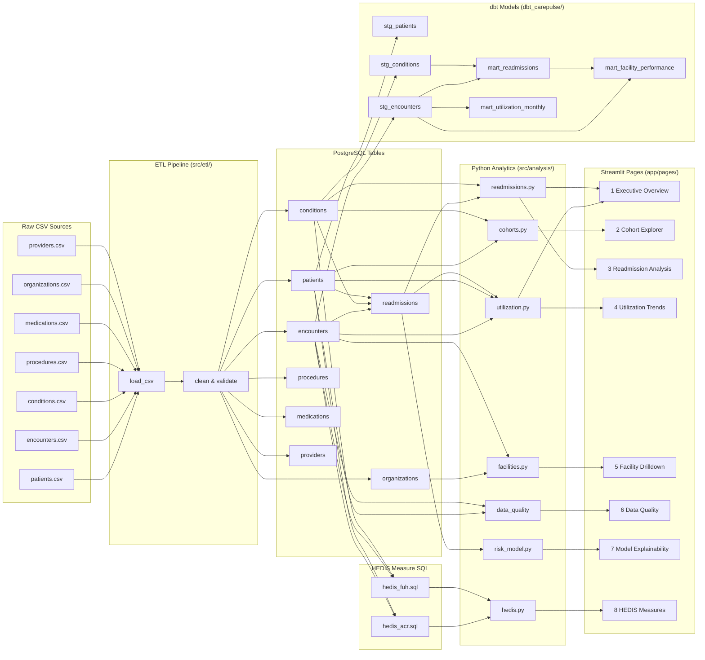

# CarePulse — Architecture

## Overview

CarePulse follows a simple **ETL → Analytics → Dashboard** architecture that mirrors real healthcare data warehousing, scaled down for a portfolio project.

## Data Flow

```
┌─────────────────┐
│ Synthetic Data   │  Python script generates realistic CSV files
│ Generator        │  (Synthea-style: patients, encounters, conditions, etc.)
└────────┬────────┘
         │  CSVs
         ▼
┌─────────────────┐
│ ETL Pipeline     │  Python + pandas
│ (src/etl/)       │  • Load CSVs
│                  │  • Clean: dedup, parse dates, handle nulls
│                  │  • Validate: type checks, range checks
│                  │  • Write to PostgreSQL via SQLAlchemy
└────────┬────────┘
         │
         ▼
┌─────────────────┐
│ PostgreSQL       │  Normalized relational tables
│ (local)          │  • patients, encounters, conditions
│                  │  • procedures, medications
│                  │  • providers, organizations
│                  │  • readmissions (derived)
└────────┬────────┘
         │
         ▼
┌─────────────────┐
│ Analytics Layer  │  SQL files (sql/) + Python (src/analysis/)
│                  │  • Readmission logic with CTEs & window functions
│                  │  • Utilization aggregations
│                  │  • Cohort breakdowns
│                  │  • Data quality queries
└────────┬────────┘
         │
         ▼
┌─────────────────┐
│ Streamlit App    │  Multi-page dashboard (app/)
│                  │  • Executive Overview with KPI cards
│                  │  • Cohort Explorer with filters
│                  │  • Readmission deep-dive
│                  │  • Utilization trends (Plotly)
│                  │  • Facility/Provider drilldown
│                  │  • Data Quality monitor
└─────────────────┘
```

## Why This Architecture

| Decision | Reason |
|----------|--------|
| Separate ETL scripts | Reproducible pipeline; easy to re-run |
| SQL in `.sql` files | SQL skills visible; reusable outside Python |
| Python analytics wrappers | Bridge between SQL results and dashboard |
| Streamlit multi-page | Each page = one analytic focus area |
| No orchestrator (Airflow) | Overkill for a local project; would obscure the analytics |

## Component Interaction

1. `run_etl.py` calls `src/etl/` modules in order: generate → load → clean → transform
2. `sql/schema.sql` defines all table structures
3. `src/analysis/` modules call `src/db.py` which reads SQL files and returns DataFrames
4. `app/` pages import from `src/analysis/` and render with Plotly

## Database

- **Engine**: PostgreSQL 14+ (local via Homebrew)
- **ORM**: None — we use raw SQL via SQLAlchemy's `text()` for transparency
- **Connection**: Single `engine` object in `src/db.py`

## Data Lineage

The diagram below traces every table from raw source through transformation to the dashboard page that consumes it.



### Reading the Diagram

| Layer | Description |
|-------|-------------|
| **Sources** | Synthea-generated CSVs dropped into `data/raw/` |
| **ETL** | `src/etl/` scripts load, clean, validate, and write to PostgreSQL |
| **PostgreSQL** | Normalized tables; `readmissions` is a derived table built during ETL |
| **dbt** | Staging models add computed columns; marts aggregate for BI queries |
| **HEDIS SQL** | Standalone measure definitions following NCQA specs |
| **Analytics** | Python modules wrap SQL queries and return DataFrames |
| **Dashboard** | Each Streamlit page imports one or more analytics modules |
